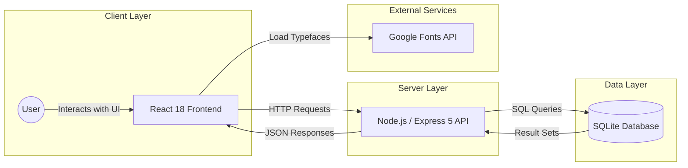

# CheckUp: Evidence-Based Health Literacy

CheckUp is a digital platform designed to combat health misinformation by bridging the gap between viral social media trends and verified medical research. Aimed at health-conscious adolescents and proactive parents, the app features a familiar social-style feed that fact-checks wellness myths using evidence-based articles.

The platform integrates gamified "Misconception Quizzes" to reinforce medical literacy, a search engine for investigating specific trends, and personalized profiles for saving verified insights.

---

## Tech Stack

### Frontend

* **React 18**: UI development
* **React Router v6**: Client-side navigation
* **Framer Motion**: Smooth animations and transitions
* **Lucide React**: Iconography

### Backend

* **Node.js**: Runtime environment
* **Express 5**: Web framework
* **better-sqlite3**: High-performance SQLite driver
* **CORS**: Middleware for cross-origin requests

### Database & Styling

* **SQLite**: Relational database storage
* **CSS3**: Custom properties, Flexbox, and Grid
* **Google Fonts**: Outfit and Playfair Display typography

---

## System Architecture



---

## Getting Started

### Prerequisites

* **Node.js**: Version 18 or higher is required.
* **Verification**: Run `node --version` in your terminal. If not installed, download it from [nodejs.org](https://nodejs.org/en/download).

### Installation

1. **Clone the repository**:
```bash
git clone [repository-url]
cd checkup-app

```


2. **Install dependencies**:
```bash
npm install

```


3. **Database Setup**:
The database is automatically initialized from the `db/checkup.db` file. No manual execution of schema or seed files is required for the initial setup.

---

## Running the Application

To start both the backend Express server and the Vite frontend simultaneously, run:

```bash
npm run dev

```

The application will be accessible at: **http://localhost:5173**

### Sample Login Credentials

| Role | Email | Password |
| --- | --- | --- |
| Admin | aiden@checkup.com | password123 |

---

## Verifying the Vertical Slice

To confirm the application is functioning correctly and persisting data:

1. **Launch the App**: Run `npm run dev`.
2. **Create Account**: Click "Create Account" and complete the registration.
3. **Navigate to Profile**: Once logged in, go to the Profile page and select **Edit Profile**.
4. **Update Username**: Enter a new username and save the changes.
5. **Confirm Persistence**: Refresh the browser page. The new username should remain visible, confirming the backend and SQLite database have successfully updated.

---
